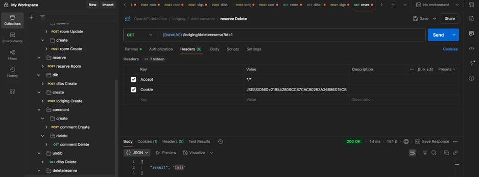
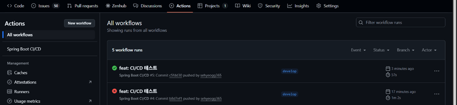

숙소 예약 프로젝트에 DevOps 및 API 도구 연동을 통한 개발 및 배포 환경 고도화

<b>1. 프로젝트 개요 </b><br>
&nbsp;&nbsp;•	간단한 소개 (숙소 예약 프로젝트 + 사용 기술 스택)<br>
   숙소를 예약하는 페이지로, 사용자페이지와 관리자 페이지 두개로 나뉘며, 회원가입, 로그인, id/pw찾기, 회원정보 수정은 사
   용자와 관리자 둘다 공용된 기능입니다.<br> 관리자는 숙소추가, 숙소 수정, 객실 추가, 객실 수정, 숙소 삭제 기능이 있습니다. 사용자는
   숙소/객실 조회, 객실 예약, 찜, 댓글작성/삭제/조회 기능이 있습니다.
-	기술스택: JAVA, HTML5, css3, javascript, jQuery, MySQL, jsp, Spring Boot, Gradle, GitHub, AWS, Docker, Github Actions, Swagger, Postman
     •	기존 프로젝트에서 느낀 한계 (수동 빌드, 수동 테스트 등)
1.	테스트가 불편하다, 직접 프로젝트를 실행 시켜 웹에서 일일이 테스트 해야한다.
2.	자동화 배포가 안된다.
3.	프로젝트 실행시 환경차이, 이식성 낮음
4.	문서화 불편, 협업 어려움 
<br><br>

<b>2. Docker 환경 설정</b><br>
&nbsp;&nbsp;•	왜 Docker 도입했는지 (개발환경 일관성 확보, 배포 간편화 등)<br>
   협업과정에서 누구나 pc및 개발 환경에 차이가 있기에 같은 프로젝트를 실행해도 차이가 있다. 그렇기에 개발, 테스트, 배포 환경차이를 극복하고 확장성을 높이기 위해 도커를 도입했다. 

&nbsp;&nbsp;•	docker-compose.yml 구성 캡처 및 설명<br>
```
# docker-compose.yml
version: '3.8'

services:
  mysql:
    image: mysql:8.0
    container_name: mysql-tour
    restart: always
    environment:
      MYSQL_ROOT_PASSWORD: root
      MYSQL_DATABASE: choongmotour
      MYSQL_USER: root
      MYSQL_PASSWORD: root
    ports:
      - "3306:3306"
    volumes:
      - dbdata:/var/lib/mysql

  springboot:
    build: .
    container_name: choongmotour-app
    depends_on:
      - mysql
    ports:
      - "8080:8080"
    environment:
      SPRING_DATASOURCE_URL: jdbc:mysql://mysql:3306/choongmotour?serverTimezone=Asia/Seoul
      SPRING_DATASOURCE_USERNAME: root
      SPRING_DATASOURCE_PASSWORD: root
      SPRING_PROFILES_ACTIVE: docker
    restart: always

volumes:
  dbdata:
```

&nbsp;&nbsp;_version:_ '3.8' 현재 도커 컴포즈 파일 버전을 의미함.

&nbsp;&nbsp;_mysql:_<br>
	mysql:8.0 이미지를 기반으로 MySQL 컨테이너를 생성.<br>
	컨테이너 명:mysql_tour 로 지정.<br>
	재시작 여부: restart: always 컨테이너가 꺼지면 항상 자동 재시작<br><br>

&nbsp;&nbsp;_environment:_<br>
	MYSQL_ROOT_PASSWORD 루트 비밀번호 root 라고 지정<br>
	MYSQL_DATABASE 생성할 DB 이름: choongmotour<br>
	사용자 정보: 아이디, 패스워드<br>
	포트 번호 (**호스트 3306 포트 ↔ 컨테이너 3306 포트 연결**)

&nbsp;&nbsp;_volumes:_<br>
- dbdata:/var/lib/mysql

	DB 데이터가 지워지지 않도록 볼륨 설정. dbdata라는 이름으로 MySQL 내부의 /var/lib/mysql과 연결.

&nbsp;&nbsp;_springboot:_<br>
	build: .: 현재 디렉토리 (.)의 Dockerfile을 기반으로 Spring Boot 이미지 빌드<br>
	container_name: 컨테이너 명 choongmotour-app 이라고 지정<br>
	depends_on:<br>
	mysql
mysql먼저 실행후 Spring Boot 컨테이너 실행되게 설정.<br>
	ports:
-	"8080:8080"
     호스트 8080 ↔ 컨테이너 8080 포트 연결<br>

_environment:_<br>
SPRING_DATASOURCE_URL: jdbc:mysql://mysql:3306/choongmotour?serverTimezone=Asia/Seoul
SPRING_DATASOURCE_USERNAME: root
SPRING_DATASOURCE_PASSWORD: root
SPRING_PROFILES_ACTIVE: docker<br><br>
	Spring Boot에서 DB 접속 및 profile 지정<br>
	mysql이라는 이름은 위의 서비스 이름이기 때문에 내부에서 잘 연결됨.<br>
	SPRING_PROFILES_ACTIVE: docker는 application-docker.yml을 적용하라는 뜻.<br>
도커 환경일시 -docker로 끝나는 yml파일 적용

&nbsp;&nbsp;_restart: always_<br>
	해당 컨테이너도 꺼지면 자동 재시작<br>

•	application.yml vs application-docker.yml 분리한 이유
application.yml에는 애플리케이션 환경에서 실행 되고, application-docker.yml은 도커 환경에서 실행 되게하기 위해 분리를 했다.
-	Docker-compose.yml 설정
     도커 환경에서 돌리고 싶을 때 yml 파일이름 뒤에 어떤 네임을 붙여야 돌아가게 할지 설정. 여기선 docker라고 붙여야 도커 환경에서 실행 되게 설정 함.<br>
     `SPRING_PROFILES_ACTIVE: docker`
-	application-docker.yml 라고 이름 설정
     그렇게 해야 위 파일에서 docker환경일 때 해당 yml파일이 실행 됨
-	src/main/resources 경로내에 있어야 함 이 세가지 조건을 지켜야 함

**3. Swagger 적용**<br>
&nbsp;&nbsp;•	Swagger 도입 목적 (API 문서 자동화, 테스트 편의성)
   API를 테스트할 때, 프론트엔드 없이도 쉽게 구조를 확인하고 요청을 날릴 수 있는 도구가 필요했습니다.
   Swagger는 API 문서를 자동으로 생성해주고, API 입력값/출력값을 쉽게 검증할 수 있어
   개발 속도와 협업 효율을 높이는 데 도움이 됐습니다.
   특히, API 스펙이 변경되었을 때도 자동 반영되는 점이 좋았습니다.

•	빌드그래들 적용 방법<br>
스프링 2.x 버전에서는
1.6.14버전에 된다.<br>
`// swagger
implementation 'org.springdoc:springdoc-openapi-ui:1.6.14'`

✅ Swagger 버전별 차이 요약

| 항목             | 1.6.x (Spring Boot 2.x)              | 2.x (Spring Boot 3.x 전용)                      |
|------------------|---------------------------------------|-------------------------------------------------|
| 호환 버전        | Spring Boot 2.x                       | Spring Boot 3.x                                 |
| 주요 클래스 위치 | `springdoc-openapi-ui`               | `springdoc-openapi-starter-webmvc-ui`          |
| 설정 방식        | 수동 설정 많음                       | 자동 구성 더 많음                               |
| 패키지명         | `org.springdoc.api` 등               | 대부분 동일하지만 일부 클래스 구조 바뀜       |
| Swagger URL      | `/swagger-ui.html`                   | `/swagger-ui/index.html` (또는 자동 리다이렉트) |
| OpenAPI 버전     | OpenAPI 3                             | OpenAPI 3                                       |

•	Swagger UI 스크린샷 및 주요 API 테스트 예시


**4. Postman 연동**<br>
&nbsp;&nbsp;•	Swagger만으로 부족한 점 → Postman의 필요성<br>
   Swagger는 간단한 테스트용으로는 편했지만, 로그인 → 토큰 획득 → 인증이 필요한 API 요청 같이 흐름 기반 테스트에는 부족하다고 느꼈습니다.
   Postman을 활용해 컬렉션 기반 시나리오 테스트를 구성했고,
   이후에는 테스트 자동화 스크립트도 추가해 반복 테스트를 줄였습니다.
   이는 실무에서도 QA나 협업자와 공유하기 용이하다는 점에서 유용했습니다.<br><br>
&nbsp;&nbsp;•	v3/api-docs로 import → Postman 화면 구성
<br>
&nbsp;&nbsp;•	쿠키 기반 세션 유지 문제 해결법 (JSESSIONID 수동 설정 등)
1.	로그인 API 요청을 보낸 뒤 → Set-Cookie 응답 헤더에서 JSESSIONID를 수동으로 복사
2.	이후 요청부터는 Headers 탭에서 수동으로 설정:
      Key: Cookie  
      Value: JSESSIONID=복사한_값

&nbsp;&nbsp;•	API 테스트 스크린샷

1. 성공 case



<br><Br>
2. 실패 case


 
 
 
 
 
 


**5. GitHub Actions (CI/CD)**<br>
&nbsp;&nbsp;•	CI/CD 개념 간단 요약
   CI(Continuous Integration) 지속적 통합을 의미한다. 코드를 푸시 하면 자동으로 빌드/테스트를 진행한다.<br>
   CD(Continuous Delivery/Deployment)지속적 전달을 의미한다. 빌드를 성공하면 자동으로 서버에 배포한다.<br>
   일반적으로 위 방식들을 합쳐 CI/CD 파이프라인이라고 부르며, CI/CD 파이프라인을 구축하기 위한 도구로 Jenkins, Travis CI, Github Action 등이 존재합니다.<br>
&nbsp;&nbsp;•	왜 GitHub Actions 선택했는지 (무료, GitHub 통합 등)
코드 변경 시, 매번 수동으로 테스트하고 빌드하는 과정은 비효율적이라 느꼈습니다.<br>
그래서 GitHub Actions를 통해 CI/CD 파이프라인을 구성했고,<br>
코드 푸시 시 자동으로 테스트 → 빌드 → Docker 이미지 생성 및 푸시까지 진행되도록 했습니다.<br>
반복적인 수작업을 줄이고, 코드 품질 유지에 도움이 되었습니다.<br>

&nbsp;&nbsp;•	.github/workflows/ci-cd.yml 구성 파일 캡처 및 설명
```
•	name: Spring Boot CI/CD

on:
push:
branches:
- main  # main 브랜치에 push될 때 실행

jobs:
build:
runs-on: ubuntu-latest

    steps:
      - name: 📁 프로젝트 체크아웃
        uses: actions/checkout@v3

      - name: ☕ JDK 17 설정
        uses: actions/setup-java@v3
        with:
          distribution: 'temurin'
          java-version: '17'

      - name: 🛠️ Gradle로 빌드
        run: ./gradlew clean build --no-daemon

      - name: 🐳 Docker Buildx 설정
        uses: docker/setup-buildx-action@v3

      - name: 🔐 DockerHub 로그인
        uses: docker/login-action@v3
        with:
          username: ${{ secrets.DOCKERHUB_USERNAME }}
          password: ${{ secrets.DOCKERHUB_TOKEN }}

      - name: 📦 Docker 이미지 빌드 및 푸시
        uses: docker/build-push-action@v5
        with:
          context: .
          push: true
          tags: ${{ secrets.DOCKERHUB_USERNAME }}/choongmotour-app:latest
```
1. 📁 프로젝트 체크아웃
- uses: actions/checkout@v3
  → GitHub 리포지토리의 코드를 현재 작업 환경으로 가져옵니다.

2. ☕ JDK 버전 설정
- uses: actions/setup-java@v3
  → Java 17로 환경을 세팅합니다. (Spring Boot 3.x를 위해 주로 사용)

3. 🔧 gradlew 실행 권한 부여
- run: chmod +x ./gradlew
  → gradlew 파일에 실행 권한을 줍니다. (리눅스에선 이 작업 필수!)

4. 🛠️ Gradle로 빌드
- run: ./gradlew clean build --no-daemon
  → 프로젝트를 Gradle로 빌드합니다.
  테스트 포함해서 전체 빌드가 수행됩니다. (빌드 실패 시 여기서 CI 실패 처리)

5.	🐳 Docker Buildx 설정
- uses: docker/setup-buildx-action@v3
  → Docker Buildx를 사용하면 다양한 아키텍처 및 고급 옵션으로 Docker 이미지를 빌드할 수 있게 됩니다.
  (Buildx는 확장된 Docker 빌드 기능이라 보면 됨)

6. 🔐 DockerHub 로그인
- uses: docker/login-action@v3
  → GitHub Secrets에 저장된 DOCKERHUB_USERNAME / DOCKERHUB_TOKEN으로 DockerHub에 로그인합니다.
  🔒 secrets는 외부에 노출되지 않아서 보안상 안전하게 계정 정보를 전달하는 방식이에요.

7. 📦 Docker 이미지 빌드 및 푸시
- uses: docker/build-push-action@v5
  with:
  context: .
  push: true
  tags: ${{ secrets.DOCKERHUB_USERNAME }}/choongmotour-app:latest
  → 현재 디렉토리(.) 기준으로 Dockerfile을 찾아 이미지를 빌드한 뒤,
  → DockerHub의 choongmotour-app:latest로 자동 푸시합니다.
  📌 즉, develop 브랜치에 코드 push → 자동 빌드 → 자동 이미지 푸시까지 한방에!

•	CI/CD 트러블 슈팅<br>
실패원인: gradlew 실행 권한 문제 -> DockerHub 토큰 `read-only` 설정<br>
수정한 것: gradlew 실행 권한 부여 -> chmod +x ./gradlew,<br>
DockerHub 회원가입 및 `Access Token` 새로 생성 후 `read-only` 설정
`GitHub Secrets`에 DOCKERHUB_USERNAME, DOCKERHUB_TOKEN 등록
최종 결과  | CI/CD 성공! 이미지 푸시 완료

•	CI/CD 동작 흐름 (push → build → docker image 생성 → 실행)
1.	main브랜치에 푸시 될 때 마다
2.	프로젝트 빌드
3.	도커 이미지 생성
4.	Docker Hub에 자동으로 푸쉬

•	성공한 빌드 스크린샷


**6. 실행 결과 요약**<br>
   •	모든 연동 구성 완료 후 실제 실행 장면 스크린샷<br>
   •	Docker 컨테이너 실행 화면 + Swagger API + Postman 테스트 결과<br>


<br>
**7. 도입 효과 및 회고**<br>
&nbsp;&nbsp;•	기술적 개선 효과 요약<br>

| 도입 기술        | 개선 효과                                 |
|------------------|---------------------------------------|
| Docker           | “환경 일관성을 유지하며 개발–배포 간격을 줄이기 위해 도입”    |
| Swagger          | “API 테스트 및 명세 자동화를 통해 팀 내 커뮤니케이션 효율화” |
| Postman          | “세션 기반 API 테스트, 오류 재현 시나리오 작성에 유리”    |
| GitHub Actions   | “CI/CD 자동화를 통해 개발 흐름에 배포를 통합”         |
<br>
•	DevOps에 대한 이해도 향상, CI/CD, 테스트 자동화에 대한 경험 축적<br>
•	다음 목표: Redis 기반 캐시 적용, JUnit + Mockito로 테스트 자동화, 기타 기능들 구현
